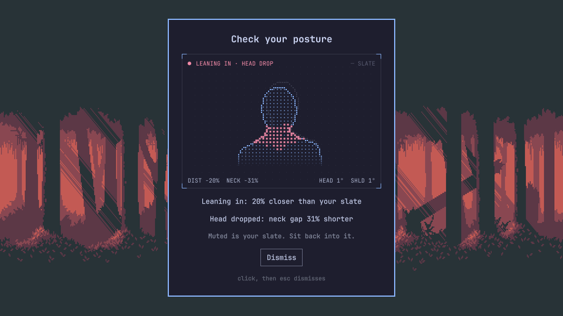

# Posture

A posture monitor for [Omarchy](https://omarchy.org). It watches you through
the webcam and compares you to your own good posture, "the slate". Drift too
far for too long and a small card shows what changed.



## Features

- **Your posture, not a textbook's.** A front webcam cannot measure clinical
  neck angles. So every check compares you to a slate you record yourself.
- **Four checks, each switchable:** leaning in, head drop (slouch), head tilt,
  side lean.
- **Says why.** The card shows a scope view of your slate and your posture now,
  plus one line per failed check, e.g. "Leaning in: 31% closer than your slate".
- **Quiet.** The card waits out a delay you choose (10 s to 10 min). It closes
  on its own when you sit back. It takes no keys until you click it. It
  shows over fullscreen games too.
- **Side monitors.** Looking at a side screen is ignored by default. Or record
  one slate per monitor.
- **Private.** Frames stay in memory in the helper. Only keypoints reach the
  shell. Nothing is sent anywhere. The camera LED is on while it watches.
- **Light.** About 35 MB RAM and 8% of one CPU core at 5 frames per second.
  CPU only.

## Install

The plugin needs the helper, a small Rust program that reads the camera and
runs the pose model.

```bash
curl -LO https://github.com/mjasnikovs/omarchy-posture/releases/download/v0.1.0/omarchy-posture-helper-0.1.0-1-x86_64.pkg.tar.zst
sudo pacman -U omarchy-posture-helper-0.1.0-1-x86_64.pkg.tar.zst
omarchy plugin add https://github.com/mjasnikovs/omarchy-posture.git --enable
omarchy restart shell
```

The helper is not on the AUR yet. On aarch64, build it from source with
`makepkg -si` in `packaging/aur`.

> Plugins run unsandboxed inside your shell. Read the code before you enable it.

## Usage

1. Click the bust icon in the bar.
2. Sit well and look at your main screen.
3. Press **Record slate**. Hold still for 5 seconds.

| Action | How |
|---|---|
| Open or close the panel | Click the icon, or `omarchy-shell mjasnikovs.posture panel` (focused monitor) |
| Pause (camera off) | Switch in the panel, middle-click the icon, or `omarchy-shell mjasnikovs.posture toggle` |
| Dismiss the card | "Dismiss" or Esc. The delay starts over |

### How it behaves

- Bad posture must last the whole delay before the card shows. Two seconds
  without bad posture ends it.
- When it cannot see you clearly, it does not judge. That covers turning to a
  side monitor, leaving the desk, and covering the camera.
- Pause releases the camera, so video calls can use it. Pause survives a shell
  restart.
- A screen lock releases the camera within about 40 seconds, and unlocking
  brings it back.

## Settings

Stored in `~/.config/omarchy/shell.json` on the widget entry:

```json
{ "id": "mjasnikovs.posture", "strictness": 3, "delaySeconds": 60, "sideMode": "ignore",
  "checkLeanIn": true, "checkHeadDrop": true, "checkHeadTilt": true, "checkSideLean": true }
```

`helperPath` and `device` are optional overrides for the helper binary and the
camera (`/dev/v4l/by-id/...`).

Slates live in `~/.local/state/omarchy/posture/slates.json`. They hold
keypoint positions only, no images.

## Scripting

```bash
omarchy-shell mjasnikovs.posture status    # JSON: status, helper, slate, alert, reasons
omarchy-shell mjasnikovs.posture pause
omarchy-shell mjasnikovs.posture resume
omarchy-shell mjasnikovs.posture toggle
omarchy-shell mjasnikovs.posture record    # record a slate now
omarchy-shell mjasnikovs.posture dismiss
omarchy-shell mjasnikovs.posture panel     # toggle the panel on the focused monitor
```

## Update

```bash
omarchy plugin update mjasnikovs.posture
omarchy restart shell
```

The service is kept loaded, so new code needs the restart.

## Remove

```bash
omarchy plugin remove mjasnikovs.posture
rm -rf ~/.local/state/omarchy/posture
```

## Requirements

- Omarchy 4 (Quattro) with the Quickshell-based `omarchy-shell`.
- A webcam at the top of your main screen.
- `omarchy-posture-helper`. It is a Rust program with the
  RTMPose-t model (Apache-2.0). The package build downloads the model from
  OpenMMLab and checks it against pinned sha256 sums.
- No network access at run time. Three subprocesses, all plain argument lists:
  the helper, `mkdir -p` for the state folder, and `omarchy-shell lock isLocked`.
- [bun](https://bun.sh) and cargo only for development.

## How it was chosen

Every model and runtime was measured on a labelled recording before any of
this was built. See `bench/RESULTS.md`. RTMPose-t on
[tract](https://github.com/sonos/tract) matched the best accuracy (91.5%
balanced) with the least RAM and disk.

The research behind the design:

- Clinical forward-head measures need a side view. Front-camera proxies are
  not clinically validated, hence the personal slate.
- Feedback against your own "good" image kept improvements at 6 weeks in a
  randomized trial (Taieb-Maimon et al. 2012, doi:10.1016/j.apergo.2011.05.015).
- The link between posture and neck pain is weak. Long, unbroken sitting
  matters too, so take breaks.

## Development

Clone outside `~/.config/omarchy/plugins` (the shell refuses symlinks, and
`node_modules` has some).

```bash
bun install
bun run lint                 # prettier, eslint --fix, tsc
bun test                     # model tests, including the recorded session
(cd helper && cargo test)
scripts/dev-install.sh       # build, copy plugin, install helper to ~/.local/bin
bun run release              # check + build + validate what is committed
```

The helper can run without a camera, even while the plugin runs:

```bash
omarchy-posture-helper --replay test/fixtures/rec3.jsonl --loop
```

`--record` writes keypoints only. It needs the camera, so pause the plugin first:

```bash
omarchy-shell mjasnikovs.posture pause
omarchy-posture-helper --record /tmp/poses.jsonl
```

## License

MIT. The pose model is Apache-2.0. See `THIRD_PARTY.md`.
